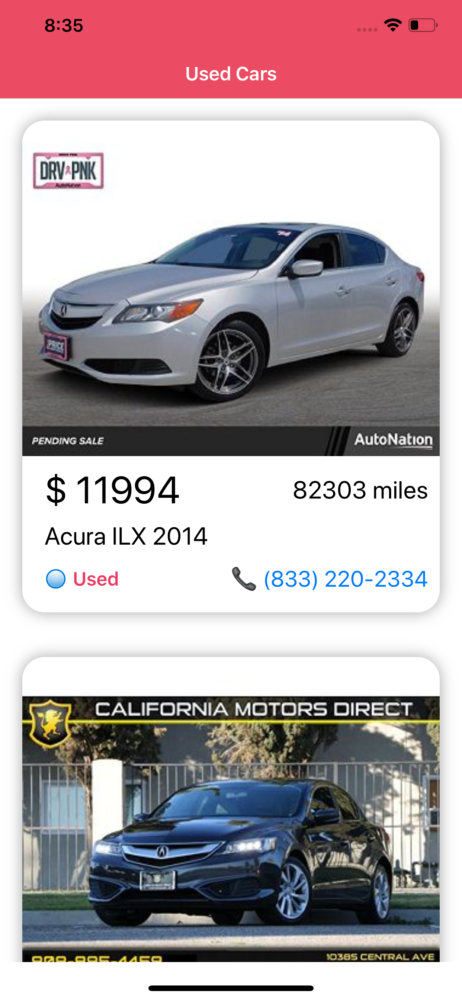
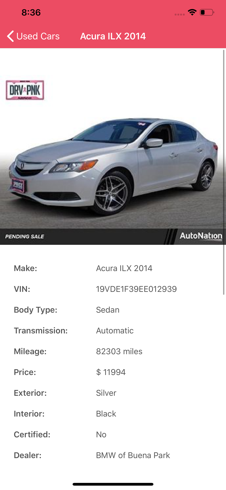
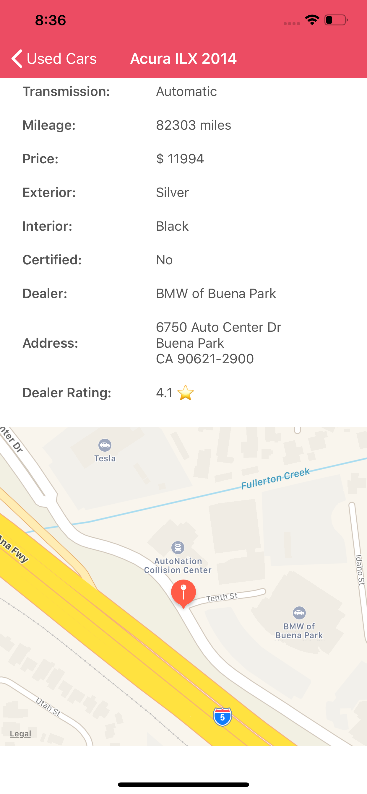
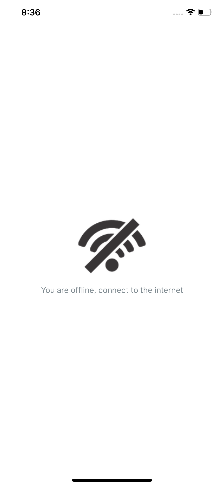

# AutoCar (iOS - Swift)

iOS app that display a feed of used car listings in Swift from Carfax. A host of details about a used car is available through this app such as car model, car price, car mileage, dealer details, dealer rating, car pictures etc. 

# Features 

- Used Car details (price, mileage, picture, color, model) 
- Display Dealer details and location
- Call Dealer from the app
- Check for Internet Connection
- Superior Design
- Built with Swift

# Requirements

- iOS 12
- Cocoapods (Run "pod install" on project directory and open AutoCar.xcworkspace)

# Screenshots

  
  
  
  
  

